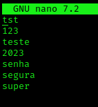
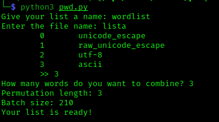
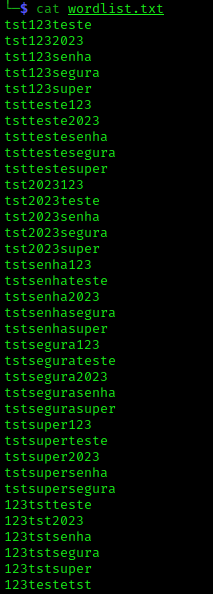

# PWDGEN
O objetivo desse programa é gerar combinações de palavras a partir de uma lista.

Recomenda-se o uso desse script com outros programas também para gerar mais variações de senhas ou palavras chave, como o **CEWL**, **CUPP** e o **hashcat** com algumas regras.

